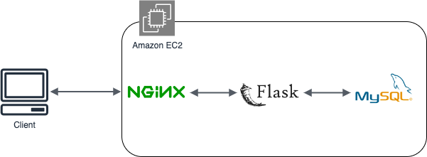
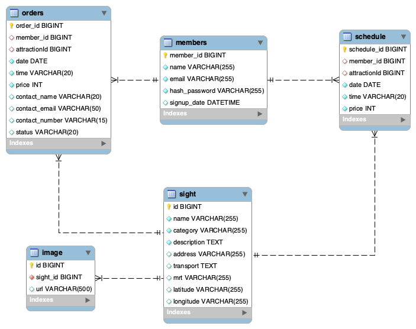

# Taipei-day-trip-website

Taipei-day-trip-website is a tourism e-commerce website where users can find and book one-day sightseeing trip in Taipei city.

This is my first project built from Flask and vanilla Javascript in [WeHelp bootcamp](https://training.pada-x.com/wehelp/).

🖥️ Website URL : https://www.taipeidaytrip.xyz/

✏️ Test account and password : test@gmail.com / 123abcABC

## Demo

- Viewing information about one-day tours.
  
- Choose and book a tour.       

## Table of Contents

- [Main Features](#main-features)
- [Backend Technique](#backend-technique)
  - [Language / Web Framework](#language--web-framework)
  - [AWS Cloud Service](#aws-cloud-service)
  - [Database](#database)
  - [Networking](#networking)
  - [Version Control](#version-control)
- [Server Architecture](#server-architecture)
- [Database Schema](#database-schema)
- [Frontend Technique](#frontend-technique)
- [Contact](#contact)
## Main Features

- Member system.
- Search tours by related keyword.
- Infinite scroll down loading.
- Tours image carousel.
- Responsive web design.
- Online payment by [TapPay](https://www.tappaysdk.com/zh/).  
## Backend Technique

#### Language / Web Framework
- Python / Flask

#### AWS Cloud Service
- EC2

#### Database
- MySQL

#### Networking
- HTTP & HTTPS
- Domain Name System (DNS)
- NGINX
- SSL (Let's Encrypt)

#### Version Control
- Git / GitHub

## Server Architecture

## Database Schema

## Frontend Technique

- HTML
- Javascript
- CSS

## Contact

👨🏻‍💻 許哲瑋 Che Wei Hsu 

📬 Email : whph60308@gmail.com
